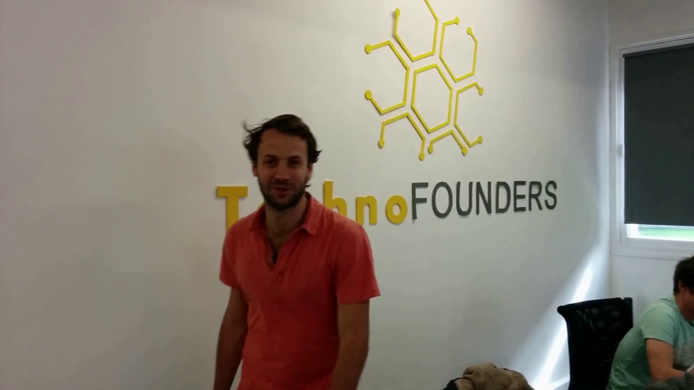
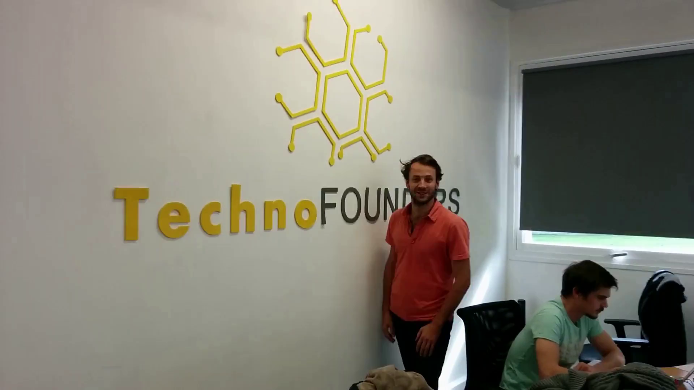

<!-- PROJECT LOGO -->
 

  <h1 align="center">Corrupted Video Restoration</h1>

  

    Restore corrupted videos with frame disorder and noises
     
  

## Built With

* OpenCV
* NumPy
* Scikit-image (optional)

## Technical Details

### 1. Overview

The corrupted video contains irrelevant noises that differs visually from original frames. All (or most) frames are
preserved, though in a random order. Visual similarity/distance between frames can be exploited for frame
association. The algorithm is realized with Python and common libraries like OpenCV, numpy and ffmpeg.

Corrupted Video

### 2. Denoising

Noises are completely irrelevant to the original video. Therefore, a simple filter on image-wise mean RGB (BGR with
OpenCV realization) vector is sufficient for noise removal. Concretely, the mean value of all images is set as
cluster center; any image too far from the center (with a distance larger than the standard deviation) is considered
as outlier.

For more complex or video-relevant noises, more sophisticated features (see Sector 3 below) may be
investigated for more robust alternatives.

### 3. Rearrangement

Adjacent frames are more similar than temporally distant ones. A simple visual descriptor with spatial information is
used to extract features from every frame. Average pooling on RGB channels is chosen and realized in a HOG style instead
of 2D convolution/filter. The speed comparison is interesting but not conducted in this experiment. Other features like
HOG can be much more powerful but more time-consuming. With features extracted, the frame rearrangement reduces to a
graph problem. Each frame is a vertex and an edge is weighted by the distance of the frame feature vectors. L2 norm is
used here, while more complex metrics may be selected for more complicated tasks. The objective is to find the shortest
path connecting all the vertices without rings.

The largest distance may not indicating a most separated pair, whereas the nearest pair should always be adjacent. A
dynamic programming that looks for the least-weighted edge to the frame sequence head and tail supervises the growth of
rearranged list of frames.

### 4. Order

Unfortunately, the rearranged sequence may be reversed: most features and their related metrics are commutative, which
results in an undirected graph. Motion blur in a single frame and optical flow between frames are thoroughly
investigated, but none of them, neither their combination, provides chronological order. The video order is more like a
semantic concept rather than a technical thing, which requires prior information to determine. A human motion
recognition and understanding model might be helpful for this specific video. However, it usually demands 3D or depth
information and breaks the rule of being generic (human movement). Another solution could be a well-trained order
classification model. But it is very hard for a deep architecture to explicitly extract inter-frame motion information,
not to mention its understanding. I tested some deep learning methods on MOT16 dataset, ending up with no knowledge
learnt. The research on this topic might be beyond the scope. Another interesting angle could be sound-based rewind
detection.

A workaround is to provide minimum human knowledge as reference. For example, an ordered pair indicating a certain frame
is chronologically in front of another (as used in this demo).

### 5. Misc

Restored Video

The restored video is generated from the rearranged image sequence with the same codec and fps of the original corrupted
video. The AVC1 encoder, provided by ffmpeg, is not available by default in precompiled opencv-python library, due to
license (GPL) issues. To correctly save the video, OpenCV needs to be compiled from source with ffmpeg included.

No dedicated parallelization or GPU acceleration is applied in this realization. For the given video, the restoration
process takes around 7.5s, or 9.1s with video I/O.

<!-- CONTACT -->

## Contact

Bonan Cuan - bonan dot cuan arobase gmail dot com

